# Site Path Search - Frontend (Svelte)

A modern, interactive web application for discovering navigation paths between websites through link analysis. Built with SvelteKit, TypeScript, and a comprehensive testing ecosystem.

## 🚀 Quick Start

```bash
# Install dependencies
npm install

# Start development server
npm run dev

# Open browser to http://localhost:5173
```

## 📁 Project Overview

This SvelteKit application provides an intuitive interface for analyzing website link structures and finding navigation paths between URLs. It features an interactive canvas-based visualization system with drag-and-drop nodes, real-time link analysis, and both manual and autonomous pathfinding modes.

### Key Features

- **Interactive Canvas**: Drag-and-drop nodes with zoom and pan capabilities
- **Real-time Link Analysis**: Live website scanning and link extraction
- **Dual Modes**: Manual exploration and AI-driven autonomous pathfinding
- **Website Previews**: Screenshot integration for visual context
- **Dark/Light Themes**: Persistent theme switching
- **Responsive Design**: Works across desktop and mobile devices
- **Accessibility**: Full WCAG 2.1 AA compliance

## 🏗️ Architecture

### UI Component Architecture


### User Interaction Flow

```mermaid
sequenceDiagram
    participant User as 👤 User
    participant UI as 🖥️ URLInput Component
    participant PF as 🎯 PathFinder
    participant Canvas as 🎨 PathCanvas
    participant Node as 🔗 PathNode
    participant API as 🌐 Backend API
    participant Utils as ⚙️ Utility Functions

    User->>UI: Enter Start URL
    UI->>PF: Validate & Submit URL
    PF->>Utils: analyzeStartUrl()
    Utils->>API: GET /analyze-links
    API-->>Utils: Return link data
    Utils-->>PF: Node creation data
    PF->>Canvas: Add start node to state
    Canvas->>Node: Render node with links
    Node->>User: Display interactive node

    User->>Node: Click on link
    Node->>PF: onLinkClick(parentId, url)
    PF->>Utils: analyzeLinkFromNode()
    Utils->>API: GET /analyze-links
    API-->>Utils: Return child link data
    Utils-->>PF: Child node data
    PF->>Canvas: Update canvas state
    Canvas->>Node: Render new connected node

    User->>Canvas: Drag node
    Canvas->>Utils: handleCanvasMouseDown()
    Utils->>Utils: updateDragPosition()
    Utils->>Canvas: Update transform
    Canvas->>Node: Update position

    User->>UI: Switch to Autonomous Mode
    UI->>PF: Set mode = 'autonomous'
    PF->>PF: Start autonomous search
    loop Until path found or max depth
        PF->>Utils: Auto-analyze promising links
        Utils->>API: Batch analyze links
        API-->>Utils: Return analysis results
        Utils-->>PF: Update search progress
        PF->>Canvas: Update progress visualization
    end
    PF->>User: Display completed path
```



## 🧩 Components

### Core Components

#### **PathFinder.svelte**

The main application controller that orchestrates the entire pathfinding experience. Manages application state, mode switching, and coordinates between input handling and visualization.

#### **PathCanvas.svelte**

The interactive canvas container that provides zoom, pan, and node management capabilities. Handles all canvas-level interactions and maintains the visual coordinate system.

#### **PathNode.svelte**

Individual node representation with drag-and-drop functionality, link expansion, and interactive content display. Each node represents a website with its analyzed links.

#### **URLInput.svelte**

Dual-purpose input component for start and end URLs with validation, keyboard navigation, and responsive design.

### UI Enhancement Components

#### **DarkModeToggle.svelte**

Persistent theme switcher that maintains user preferences across sessions and provides smooth theme transitions.

#### **WebsitePreview.svelte**

Screenshot display component that integrates with the backend screenshot service to provide visual context for each website node.

#### **SummaryBubble.svelte**

Compact statistics display showing link counts, categories, and analysis results for quick node assessment.

#### **LinkCard.svelte**

Categorized link display with color-coded types (main text, images, etc.) for easy visual identification.

#### **LinksList.svelte**

Paginated, clickable list of discovered links with support for large datasets and smooth scrolling.

#### **ErrorDisplay.svelte**

Contextual error messaging component that provides user-friendly error handling with actionable feedback.

### Display Components

#### **ResultsDisplay.svelte**

Comprehensive results panel that shows path completion status, statistics, and navigation options.

#### **LinkFinder.svelte**

Advanced link discovery interface with filtering, sorting, and bulk analysis capabilities.

## 🛠️ Technology Stack

### Core Technologies

- **SvelteKit 2.22.0**: Full-stack framework with SSR capabilities
- **TypeScript 5.0**: Type-safe development with modern language features
- **Vite 7.0**: Lightning-fast build tool and development server
- **TailwindCSS 4.0**: Utility-first CSS framework with modern design system

### Development Tools

- **ESLint**: Code quality and consistency enforcement
- **Prettier**: Automated code formatting
- **Svelte Check**: TypeScript checking for Svelte components

### Testing & Quality Assurance

- **Vitest 3.2**: Fast unit testing with browser environment support
- **Storybook 9.1**: Component testing and documentation
- **Storybook 9.0**: Component development and visual testing

## 🧪 Testing Strategy

### Testing Ecosystem Overview


### Test Categories

#### Unit Tests (90%+ Coverage)

- **Pure function testing** for all utility modules
- **State management verification** for complex operations
- **Algorithm validation** for positioning and collision detection
- **API integration mocking** for reliable test execution

#### Component Tests via Storybook

- **Visual state documentation** for all component variations
- **Interactive behavior testing** with user simulation
- **Edge case demonstration** for robust component design
- **Accessibility compliance verification** with automated testing

#### End-to-End Tests

- **Complete user workflows** from start to finish
- **Cross-browser compatibility** testing
- **Performance benchmarking** under various conditions
- **Accessibility validation** with real assistive technologies

### Running Tests

```bash
# Unit tests
npm run test:unit              # Run all unit tests
npm run test:unit -- --watch   # Watch mode for development
npm run test:unit -- --coverage # Generate coverage report

# Storybook development
npm run storybook              # Start Storybook dev server
npm run build-storybook        # Build static Storybook

# Storybook
npm run storybook              # Start Storybook dev server
npm run build-storybook        # Build for production
```

### Storybook Development

#### Story Structure

Each component includes comprehensive stories covering:

- **Basic states**: Default, loading, error, empty
- **Interactive demos**: User interaction flows and responsiveness
- **Edge cases**: Long URLs, large datasets, error conditions
- **Accessibility focus**: Keyboard navigation and screen reader compatibility

#### Example Story Usage

```svelte
<!-- PathCanvas.stories.svelte -->
<Story name="Empty Canvas" args={{ pathState: emptyPathState }}>
	<div style="height: 600px; border: 1px solid #ccc;">
		<PathCanvas {...args} />
	</div>
	<p class="mt-4 text-sm text-gray-600">
		Empty canvas showing blank start and end nodes. Try zooming and panning.
	</p>
</Story>
```

#### Interactive Playground

Storybook provides interactive controls for:

- **Component props manipulation** in real-time
- **Event action logging** for debugging interactions
- **Responsive viewport testing** across device sizes
- **Accessibility audit results** with automated scanning

#### Visual Testing Benefits

- **Design system consistency** across all components
- **Component isolation** for focused development
- **Documentation generation** with automatic prop detection
- **Quality assurance** through visual regression testing

## 📁 Directory Structure

```
svelte/
├── src/
│   ├── lib/
│   │   ├── components/          # Svelte components
│   │   │   ├── DarkModeToggle.svelte    # Theme switching
│   │   │   ├── ErrorDisplay.svelte      # Error handling UI
│   │   │   ├── LinkCard.svelte          # Link category display
│   │   │   ├── LinkFinder.svelte        # Link discovery interface
│   │   │   ├── LinksList.svelte         # Paginated link lists
│   │   │   ├── PathCanvas.svelte        # Main canvas container
│   │   │   ├── PathFinder.svelte        # Core application logic
│   │   │   ├── PathNode.svelte          # Interactive node display
│   │   │   ├── ResultsDisplay.svelte    # Results panel
│   │   │   ├── SummaryBubble.svelte     # Statistics display
│   │   │   ├── URLInput.svelte          # URL input fields
│   │   │   └── WebsitePreview.svelte    # Screenshot integration
│   │   ├── services/            # API integration
│   │   │   └── linkAnalysisService.ts   # Backend communication
│   │   ├── types/               # TypeScript definitions
│   │   │   └── linkAnalysis.ts          # Core data types
│   │   ├── utils/               # Pure utility functions
│   │   │   ├── canvasOperations.ts      # Canvas state management
│   │   │   ├── collisionDetection.ts    # Node overlap prevention
│   │   │   ├── connectionUtils.ts       # Node relationships
│   │   │   ├── nodeAnalysis.ts          # URL processing
│   │   │   ├── nodeDragging.ts          # Drag & drop logic
│   │   │   ├── nodeInteraction.ts       # UI interaction states
│   │   │   ├── nodePositioning.ts       # Smart positioning
│   │   │   └── pathStateManager.ts      # Global state management
│   │   ├── config.ts            # Application configuration
│   │   └── index.ts             # Library exports
│   ├── routes/
│   │   ├── +layout.svelte       # Application layout
│   │   └── +page.svelte         # Main application page
│   ├── stories/                 # Storybook stories
│   │   ├── *.stories.svelte     # Component stories
│   │   └── assets/              # Story assets
│   └── app.html                 # HTML template
├── src/stories/                 # Storybook component stories
│   ├── accessibility.test.ts    # WCAG compliance tests
│   ├── path-finding.test.ts     # Core functionality tests
│   └── performance.test.ts      # Performance benchmarks
├── .storybook/                  # Storybook configuration
│   ├── main.ts                  # Storybook setup
│   ├── preview.ts               # Global story configuration
│   └── test-runner.ts           # Test runner configuration
├── static/                      # Static assets
├── coverage/                    # Test coverage reports

├── svelte.config.js            # SvelteKit configuration
├── vite.config.ts              # Vite build configuration
├── tsconfig.json               # TypeScript configuration
├── tailwind.config.js          # TailwindCSS configuration
└── package.json                # Project dependencies
```

## 🔧 Development

### Prerequisites

- Node.js 18+
- npm or pnpm
- Modern browser with ES2020+ support

### Environment Setup

```bash
# Clone the repository
git clone <repository-url>
cd site-path-search/svelte

# Install dependencies
npm install

# Start development server
npm run dev

# Open http://localhost:5173 in your browser
```

### Development Commands

```bash
# Development
npm run dev                    # Start dev server with hot reload
npm run build                  # Production build
npm run preview               # Preview production build

# Code Quality
npm run lint                  # Run ESLint
npm run format               # Format code with Prettier
npm run check                # TypeScript type checking
npm run check:watch          # Type checking in watch mode

# Testing
npm run test                 # Run all tests
npm run test:unit            # Unit tests only
npm run storybook            # Component development
npm run storybook            # Start Storybook

# Maintenance
npm run prepare              # Prepare SvelteKit
```

### Adding New Components

1. **Create the component** in `src/lib/components/`
2. **Add TypeScript types** in `src/lib/types/` if needed
3. **Write unit tests** for any utility functions
4. **Create Storybook stories** for visual documentation
5. **Add Storybook stories** for new components
6. **Update this README** with component documentation

### Code Style Guidelines

- **Use TypeScript** for all new code
- **Follow Prettier formatting** (automatic on save)
- **Write descriptive component props** with JSDoc comments
- **Prefer composition** over inheritance
- **Keep components focused** on single responsibilities
- **Use semantic HTML** for accessibility

## 🎨 Styling & Design

### Design System

- **TailwindCSS 4.0** for utility-first styling
- **CSS custom properties** for theme variables
- **Responsive design** with mobile-first approach
- **Dark/light mode** support throughout

### Theme Implementation

```css
/* CSS custom properties for consistent theming */
:root {
	--color-primary: theme('colors.blue.600');
	--color-surface: theme('colors.white');
	--color-text: theme('colors.gray.900');
}

.dark {
	--color-primary: theme('colors.blue.400');
	--color-surface: theme('colors.gray.800');
	--color-text: theme('colors.gray.100');
}
```

### Component Styling Patterns

- **BEM-inspired naming** for component-specific styles
- **Utility classes** for spacing and layout
- **Custom CSS** only for complex interactions
- **Consistent spacing scale** using Tailwind tokens

## 🌐 API Integration

### Backend Communication

The frontend communicates with the Python backend API through:

- **LinkAnalysisService**: RESTful API for link analysis
- **Screenshot Service**: Image generation for website previews
- **WebSocket connections**: Real-time autonomous search updates

### Error Handling

- **Graceful degradation** for offline scenarios
- **User-friendly error messages** with actionable guidance
- **Retry mechanisms** for transient failures
- **Loading states** for long-running operations

## ♿ Accessibility

### WCAG 2.1 AA Compliance

- **Keyboard navigation** for all interactive elements
- **Screen reader support** with semantic HTML and ARIA labels
- **Color contrast compliance** for all text and UI elements
- **Focus management** with visible focus indicators

### Accessibility Features

- **Tab order optimization** for logical navigation flow
- **Skip links** for main content access
- **Alternative text** for all images and visual content
- **High contrast mode** support

## 📱 Responsive Design

### Breakpoint Strategy

- **Mobile first**: 320px minimum width
- **Tablet**: 768px and up
- **Desktop**: 1024px and up
- **Large screens**: 1440px and up

### Mobile Optimizations

- **Touch-friendly targets** (44px minimum)
- **Gesture support** for canvas interactions
- **Optimized layouts** for small screens
- **Performance optimization** for mobile networks

## 🚀 Performance

### Optimization Strategies

- **Code splitting** with dynamic imports
- **Image optimization** with WebP support
- **Bundle analysis** with Vite's built-in tools
- **Tree shaking** for minimal bundle size

### Performance Monitoring

- **Core Web Vitals** tracking
- **Bundle size monitoring** in CI/CD
- **Performance budgets** for critical metrics
- **Lighthouse scoring** targets

## 🔒 Security

### Security Measures

- **Content Security Policy** (CSP) headers
- **Input validation** for all user inputs
- **XSS prevention** with proper escaping
- **HTTPS enforcement** in production

## 📦 Deployment

### Build Process

```bash
# Production build
npm run build

# Preview production build locally
npm run preview
```

### Static Site Generation

- **Pre-rendered pages** for better SEO
- **Dynamic imports** for optimal loading
- **Asset optimization** with Vite
- **Service worker** for offline support (future enhancement)

## 🤝 Contributing

### Development Workflow

1. **Fork the repository** and create a feature branch
2. **Write tests** for new functionality
3. **Ensure code quality** with linting and formatting
4. **Create Storybook stories** for new components
5. **Update documentation** as needed
6. **Submit a pull request** with clear description

### Quality Standards

- **100% test coverage** for utility functions
- **Storybook stories** for all components
- **Component documentation** via Storybook
- **TypeScript strict mode** compliance
- **Accessibility compliance** verification

---

# Utility Functions Documentation & Testing

This section contains comprehensive documentation for the pure TypeScript utility functions that power the Site Path Search application. All utilities are thoroughly tested with comprehensive unit tests to ensure reliability and maintainability.

## Modules Overview

### Canvas Operations (`canvasOperations.ts`)

Handles all canvas-related state management and interactions.

**Key Functions:**

- `createCanvasState()` - Creates initial canvas state
- `handleCanvasMouseDown/Move/Up()` - Mouse interaction handlers
- `handleCanvasKeyDown()` - Keyboard navigation
- `handleCanvasWheel()` - Zoom functionality
- `zoomIn/Out()` - Programmatic zoom controls
- `resetView()` - Reset canvas to default view

**Test Coverage:** 100% - All interaction scenarios and edge cases tested

### Collision Detection (`collisionDetection.ts`)

Implements collision detection for node positioning.

**Key Functions:**

- `checkRectangleCollision()` - Basic rectangle overlap detection
- `checkPositionCollision()` - Complex node collision with previews

**Test Coverage:** 100% - All collision scenarios including edge cases

### Connection Utils (`connectionUtils.ts`)

Manages connections between nodes and path visualization.

**Key Functions:**

- `calculateConnections()` - Compute visual connections between nodes
- `getConnectionOrigin()` - Trace connection ancestry
- `createBlankStartNode/EndNode()` - Factory functions for placeholder nodes

**Test Coverage:** 100% - All connection calculations and path scenarios

### Node Analysis (`nodeAnalysis.ts`)

Handles URL analysis and node creation logic.

**Key Functions:**

- `analyzeStartUrl()` - Create and analyze start node
- `analyzeEndUrl()` - Create and analyze end node
- `analyzeLinkFromNode()` - Create child nodes from parent links

**Test Coverage:** 100% - Success, error, and edge case scenarios with mocked API

### Node Dragging (`nodeDragging.ts`)

Implements drag and drop functionality for nodes.

**Key Functions:**

- `createDragState()` - Initialize drag state
- `startDrag()` - Begin drag operation
- `updateDragPosition()` - Update position during drag
- `setupGlobalDragListeners()` - Global mouse event handling

**Test Coverage:** 100% - All drag scenarios including event handling

### Node Interaction (`nodeInteraction.ts`)

Manages node UI interaction states.

**Key Functions:**

- `createNodeInteractionState()` - Initialize interaction state
- `toggleExpanded()` - Expand/collapse nodes
- `handleKeyboardInteraction()` - Keyboard accessibility
- `getDisplayedLinks()` - Link pagination logic

**Test Coverage:** 100% - All interaction states and accessibility features

### Node Positioning (`nodePositioning.ts`)

Calculates optimal positions for new nodes.

**Key Functions:**

- `generateNodeId()` - Create unique node identifiers
- `calculateNodePosition()` - Grid-based positioning
- `findOptimalPosition()` - Collision-free positioning with spiral search
- `calculateNodePositionFromParent()` - Smart relative positioning

**Test Coverage:** 100% - All positioning algorithms and collision avoidance

### Path State Manager (`pathStateManager.ts`)

Central state management for the path data.

**Key Functions:**

- `createInitialPathState()` - Initialize empty state
- `selectNode()` - Node selection management
- `updateNodePosition()` - Position updates
- `clearPath()` - Reset functionality

**Test Coverage:** 100% - All state operations and data integrity

## Testing Philosophy

### Pure Functions

All utilities are implemented as pure functions where possible:

- Predictable inputs and outputs
- No side effects
- Easy to test in isolation
- Composable and reusable

### Comprehensive Coverage

Each module includes tests for:

- **Happy path scenarios** - Normal expected usage
- **Edge cases** - Boundary conditions and unusual inputs
- **Error handling** - Network failures, invalid data, etc.
- **State management** - Proper state transitions
- **Performance** - Efficiency with large datasets

### Test Structure

```typescript
describe('ModuleName', () => {
	describe('functionName', () => {
		it('should handle normal case', () => {
			// Test expected behavior
		});

		it('should handle edge case', () => {
			// Test boundary conditions
		});

		it('should handle error case', () => {
			// Test error scenarios
		});
	});
});
```

## Running Tests

```bash
# Run all utility tests
npm run test:unit

# Run specific module tests
npm run test:unit -- canvasOperations.test.ts

# Run with coverage
npm run test:unit -- --coverage

# Watch mode for development
npm run test:unit -- --watch
```

## Test Data and Mocks

### Mock Objects

Common mock objects are defined in test files:

```typescript
const mockPathState: PathState = {
	startUrl: 'https://example.com',
	endUrl: 'https://target.com',
	nodes: new Map(),
	selectedNodeId: null
};

const mockNode: PathNode = {
	id: 'test-node',
	url: 'https://test.com',
	linkSummary: mockLinkSummary
	// ... other properties
};
```

### API Mocking

External dependencies are mocked using Vitest:

```typescript
vi.mock('$lib/services/linkAnalysisService', () => ({
	LinkAnalysisService: {
		analyzeLinks: vi.fn()
	}
}));
```

## Adding New Utilities

When adding new utility functions:

1. **Keep functions pure** - Avoid side effects when possible
2. **Add comprehensive tests** - Cover all scenarios
3. **Document behavior** - Clear JSDoc comments
4. **Export consistently** - Use named exports
5. **Follow patterns** - Match existing code style

### Test Template

```typescript
import { describe, it, expect, beforeEach, vi } from 'vitest';
import { newUtilityFunction } from './newUtility';

describe('newUtility', () => {
	beforeEach(() => {
		// Setup common test state
	});

	describe('newUtilityFunction', () => {
		it('should handle expected case', () => {
			// Arrange
			const input = setupInput();

			// Act
			const result = newUtilityFunction(input);

			// Assert
			expect(result).toBe(expectedValue);
		});
	});
});
```

## Performance Considerations

### Algorithm Complexity

- **Node positioning**: O(n²) worst case with collision detection
- **Connection calculation**: O(n) linear with number of nodes
- **Collision detection**: O(1) for basic rectangle check

### Optimization Strategies

- **Spatial partitioning** for collision detection at scale
- **Memoization** for expensive calculations
- **Debouncing** for high-frequency updates
- **Virtual scrolling** for large link lists

### Memory Management

- Avoid memory leaks in event listeners
- Clean up DOM references
- Use WeakMap for temporary associations
- Limit cached calculations

## Browser Compatibility

All utilities are written in modern TypeScript/JavaScript but compiled for broad browser support:

- ES2020+ features used
- Compiled to ES2017 for compatibility
- Polyfills added automatically by Vite
- Tested in Chrome, Firefox, Safari, Edge

## Contributing

When modifying utilities:

1. Run tests before and after changes
2. Add tests for new functionality
3. Update documentation
4. Check performance impact
5. Verify browser compatibility

---

Built with ❤️ using SvelteKit, TypeScript, and modern web technologies.
